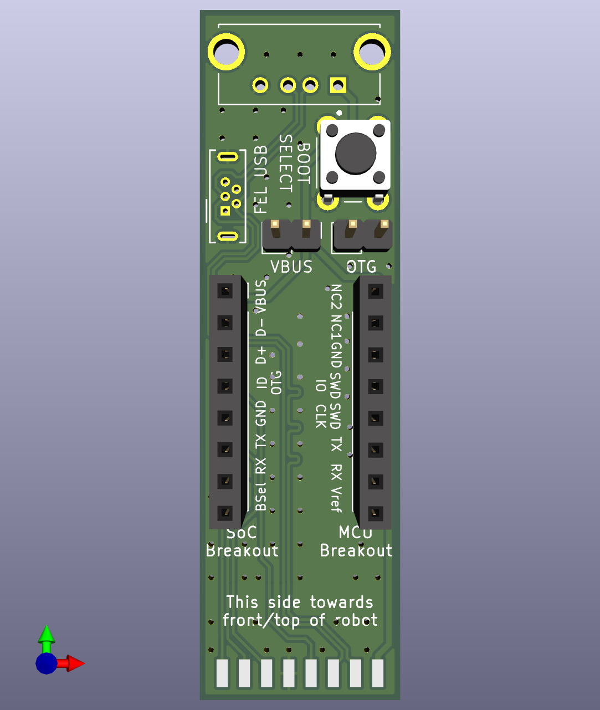

# Dreame Breakout

An improved version, of the original Dreame breakout adapter, relaid out with signal integrity in mind. Supports both UART and Fastboot methods. Refer to [valetudo-dreameadapter](https://github.com/Hypfer/valetudo-dreameadapter) for build instructions.

# Fastboot Breakout
A Fastboot only capable breakout board using a USB-C connector.
